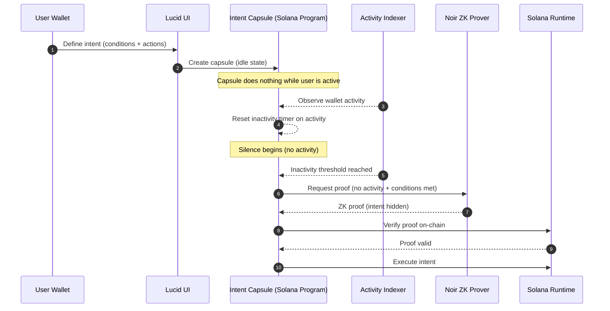
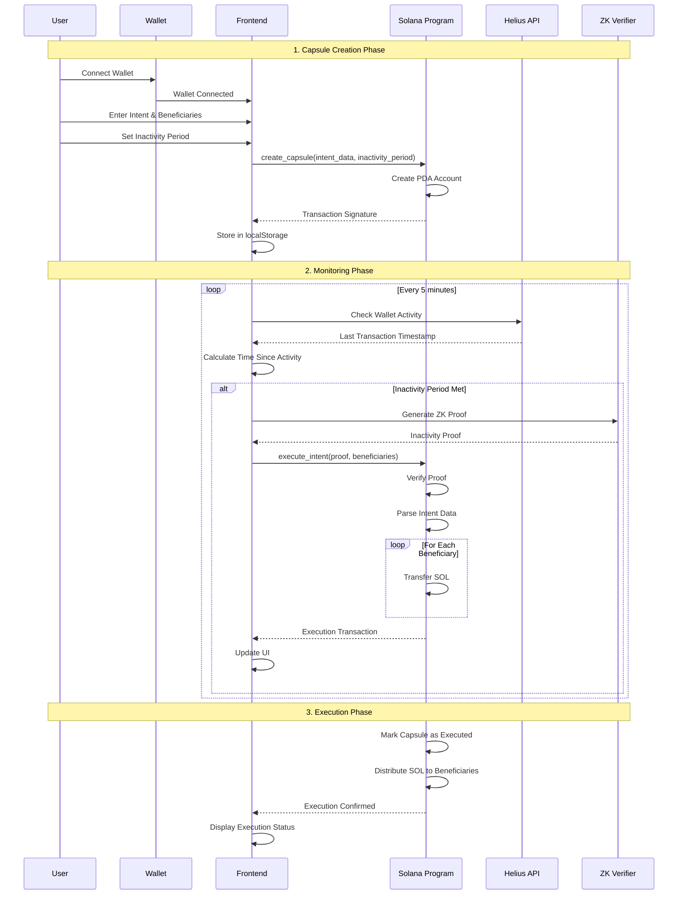
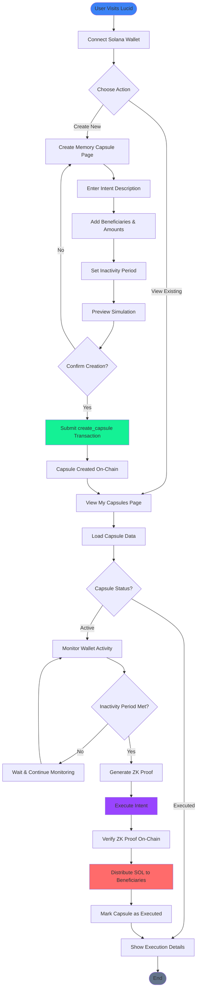

# Lucid - Intent Inheritance Protocol on Solana

> **People disappear. Intent should not.**

Lucid is an on-chain Intent Inheritance Protocol built on Solana that allows users to securely record, simulate, and automatically execute their intentions when they are no longer able to act. It ensures that your digital legacy and financial intentions are preserved and executed according to your wishes, even in your absence.

## 🎯 What is Lucid?

Lucid is a decentralized application that solves a critical problem: **what happens to your digital assets and intentions when you can no longer manage them?** Traditional solutions rely on trusted third parties or legal documents that may not be immediately accessible or executable. Lucid leverages blockchain technology to create an immutable, trustless system that automatically executes your intentions based on verifiable inactivity.

### Key Problem Solved

- **Digital Legacy Management**: Ensures your assets and intentions are executed even if you're unable to act
- **Trustless Execution**: No need for trusted executors or legal intermediaries
- **Privacy-Preserving**: Uses Zero-Knowledge proofs to verify inactivity without revealing sensitive information
- **Automatic Distribution**: Executes token transfers to beneficiaries automatically when conditions are met

## 🏗️ System Architecture

Lucid is built with a modern, decentralized architecture that combines frontend web technologies with Solana blockchain smart contracts.

### Technology Stack

- **Frontend**: Next.js 14, React, TypeScript, Tailwind CSS
- **Blockchain**: Solana (Devnet)
- **Smart Contracts**: Anchor Framework (Rust)
- **Wallet Integration**: Solana Wallet Adapter
- **RPC Provider**: Helius API
- **3D Graphics**: Three.js
- **Zero-Knowledge**: Noir (planned integration)

### Architecture Diagram



## 🔄 User Flow

### Complete User Journey



### Detailed User Flow Diagram



## 🚀 How It Works

### 1. Capsule Creation

Users create an "Intent Capsule" that contains:
- **Intent Description**: Natural language description of what should happen
- **Beneficiaries**: List of wallet addresses and their allocated amounts (fixed SOL or percentage)
- **Inactivity Period**: Time in seconds after which the capsule should execute if no activity is detected
- **Total Amount**: Total SOL to be distributed

The capsule is stored on-chain as a Program Derived Address (PDA), ensuring immutability and decentralization.

### 2. Activity Monitoring

The system continuously monitors wallet activity using:
- **Helius API**: Fetches transaction history and wallet activity
- **Periodic Checks**: Frontend checks every 5 minutes for inactivity
- **Activity Tracking**: Updates last activity timestamp on-chain when user performs transactions

### 3. Automatic Execution

When the inactivity period is met:
1. **ZK Proof Generation**: A Zero-Knowledge proof is generated to verify inactivity (currently using a development-mode proof)
2. **Proof Verification**: The Solana program verifies the proof on-chain
3. **Intent Parsing**: The program parses the JSON intent data to extract beneficiaries and amounts
4. **Token Distribution**: SOL is automatically transferred to each beneficiary according to their allocation
5. **Capsule Deactivation**: The capsule is marked as executed and deactivated

### 4. Post-Execution

After execution:
- Users can view execution transaction details
- Execution status is displayed in the UI
- Users can create a new capsule if needed (using `recreate_capsule`)

## 📋 Core Features

### Smart Contract Functions

1. **`create_capsule`**: Initialize a new Intent Capsule with intent data and inactivity period
2. **`update_intent`**: Modify the intent data of an active capsule
3. **`execute_intent`**: Execute the capsule when inactivity is proven (with ZK proof verification and SOL distribution)
4. **`update_activity`**: Update the last activity timestamp (can be called by Helius webhook or user)
5. **`deactivate_capsule`**: Manually deactivate a capsule
6. **`recreate_capsule`**: Create a new capsule from an executed state

### Frontend Features

- **3D Animated Background**: Immersive Three.js-based background
- **Material Design**: Modern UI with Material Design principles
- **Real-time Monitoring**: Live wallet activity tracking
- **Transaction History**: Display of all capsule-related transactions
- **Execution Simulation**: Preview what happens when a capsule executes
- **Auto-execution**: Automatic execution when conditions are met

## 🛠️ How It's Built

### Smart Contract (Rust/Anchor)

The Solana program is built using the Anchor framework and implements:

- **PDA-based Storage**: Each user has a unique capsule stored as a Program Derived Address
- **JSON Intent Parsing**: Intent data is stored as JSON and parsed on-chain using `serde_json`
- **SOL Distribution**: Uses `system_program::transfer` for automatic token distribution
- **ZK Proof Verification**: Verifies Noir ZK proofs for inactivity (development mode currently)
- **Security**: Owner-only execution, proper access controls, and input validation

### Frontend (Next.js/React)

The web application provides:

- **Wallet Integration**: Seamless Solana wallet connection via Wallet Adapter
- **Real-time Updates**: Automatic UI updates when transactions occur
- **Activity Monitoring**: Periodic checks for inactivity using Helius API
- **Transaction Management**: Stores and retrieves transaction signatures from localStorage
- **3D Visualizations**: Three.js for immersive user experience

### Integration Points

- **Helius API**: Wallet activity monitoring and transaction history
- **Solana RPC**: Direct blockchain interaction via Helius RPC endpoint
- **Noir ZK**: Zero-Knowledge proof generation (development mode, production verifier planned)

## 🔗 Solana, Helius, and Aztec Noir ZK Integration

Lucid integrates **Solana** (on-chain program and RPC), **Helius** (RPC and transaction APIs), and **Aztec Noir ZK** (zero-knowledge proof verification) to deliver an intent-inheritance protocol. Below is how each is used in the codebase, with links to the relevant source.

### Solana

- **On-chain program (Anchor/Rust)**  
  The Intent Capsule lives on Solana as a PDA. Instructions: `create_capsule`, `update_intent`, `execute_intent` (with ZK proof verification), `update_activity`, `deactivate_capsule`, `recreate_capsule`. SOL is distributed to beneficiaries inside `execute_intent`.  
  → [lucid_program/programs/lucid_program/src/lib.rs](https://github.com/Joseph-hackathon/Lucid_solana/blob/main/lucid_program/programs/lucid_program/src/lib.rs)

- **Client (create, execute, get capsule)**  
  Next.js app talks to the program via Anchor: create capsule, execute intent (with proof/public inputs), get capsule state, update activity, recreate capsule. Uses Helius RPC for sending transactions.  
  → [lib/solana.ts](https://github.com/Joseph-hackathon/Lucid_solana/blob/main/lib/solana.ts)

- **Connection and RPC**  
  Solana `Connection` is created with Helius RPC URL; used for all on-chain reads and transaction submission.  
  → [config/solana.ts](https://github.com/Joseph-hackathon/Lucid_solana/blob/main/config/solana.ts)  
  → [constants/index.ts](https://github.com/Joseph-hackathon/Lucid_solana/blob/main/constants/index.ts) (program ID, network, Helius key)

### Helius

- **RPC endpoint**  
  Wallet connection and all Solana RPC calls (getProgramAccounts, getBalance, sendTransaction, etc.) go through the Helius devnet RPC.  
  → [config/solana.ts](https://github.com/Joseph-hackathon/Lucid_solana/blob/main/config/solana.ts)  
  → [app/providers.tsx](https://github.com/Joseph-hackathon/Lucid_solana/blob/main/app/providers.tsx) (WalletProvider endpoint)

- **Transaction history and activity**  
  Helius `getTransactionsForAddress` (and related) is used to fetch transaction history and last-activity timestamps for capsule owners, used for monitoring inactivity and for the capsules UI.  
  → [lib/helius.ts](https://github.com/Joseph-hackathon/Lucid_solana/blob/main/lib/helius.ts)

- **On-chain “dormant” stats**  
  The app fetches program accounts and balances via RPC (Helius) to show dormant-wallet counts and estimated locked SOL/USD on the landing page.  
  → [app/api/dormant-wallets/route.ts](https://github.com/Joseph-hackathon/Lucid_solana/blob/main/app/api/dormant-wallets/route.ts)

### Aztec Noir ZK

- **Noir ZK in the flow**  
  The architecture treats “silence” (inactivity) as a provable fact: the frontend requests a proof, and the Solana program verifies it before executing the intent. The flow (request proof → Noir ZK → verify on Solana) is described in the app’s architecture copy.  
  → [constants/architecture.ts](https://github.com/Joseph-hackathon/Lucid_solana/blob/main/constants/architecture.ts)

- **On-chain verification (Noir proof)**  
  `execute_intent` in the Solana program takes a proof and public inputs, then calls `verify_noir_proof`. That function checks proof/public-input structure and consistency (owner, last_activity, inactivity_period, current_time). Production would plug in a full Noir verifier; the repo currently uses a development-mode verifier.  
  → [lucid_program/programs/lucid_program/src/lib.rs](https://github.com/Joseph-hackathon/Lucid_solana/blob/main/lucid_program/programs/lucid_program/src/lib.rs) (see `execute_intent` and `verify_noir_proof`)

- **Frontend: proof and public inputs for execution**  
  The UI builds the proof and public inputs (e.g. from inactivity data) and calls the client `executeIntent`, which sends them to the program’s `execute_intent`.  
  → [lib/solana.ts](https://github.com/Joseph-hackathon/Lucid_solana/blob/main/lib/solana.ts) (`executeIntent`)  
  → [app/capsules/page.tsx](https://github.com/Joseph-hackathon/Lucid_solana/blob/main/app/capsules/page.tsx) (where execution is triggered from the UI)

Together, **Solana** holds the capsule state and executes intents, **Helius** provides RPC and transaction data for monitoring and UX, and **Noir ZK** (via the on-chain verifier and future prover integration) ensures inactivity can be proven and verified without revealing private details.

## 📁 Project Structure

```
Lucid/
├── app/                    # Next.js application
│   ├── create/            # Capsule creation page
│   ├── capsules/         # Capsule viewing/management page
│   ├── page.tsx          # Landing page
│   └── providers.tsx     # Solana wallet provider
├── components/            # React components
│   ├── Hero3D.tsx       # 3D animated background
│   └── WorkflowDemo.tsx  # Interactive workflow demonstration
├── config/               # Configuration files
│   └── solana.ts        # Solana connection utilities
├── constants/            # Application constants
│   └── index.ts         # Program ID, API keys, etc.
├── lib/                  # Core libraries
│   ├── solana.ts        # Solana program interactions
│   ├── helius.ts        # Helius API integration
│   └── program.ts       # Program utilities (PDA derivation)
├── lucid_program/        # Solana smart contract
│   └── programs/
│       └── lucid_program/
│           └── src/
│               └── lib.rs # Main program logic
├── types/                # TypeScript type definitions
│   └── index.ts         # IntentCapsule, Beneficiary types
├── utils/                # Utility functions
│   ├── intent.ts        # Intent encoding/decoding
│   └── validation.ts    # Input validation
└── idl/                  # Anchor IDL files
    └── lucid_program.json
```

## 🚀 Getting Started

### Prerequisites

- Node.js 18+ and npm
- Solana wallet (Phantom, Backpack, etc.)
- Rust, Solana CLI, and Anchor (for contract development)

### Installation

1. **Clone the repository**
   ```bash
   git clone <repository-url>
   cd lucid
   ```

2. **Install dependencies**
   ```bash
   npm install
   ```

3. **Configure environment variables**
   
   Create a `.env.local` file:
   ```env
   NEXT_PUBLIC_SOLANA_NETWORK=devnet
   NEXT_PUBLIC_HELIUS_API_KEY=your_helius_api_key
   NEXT_PUBLIC_PROGRAM_ID=D6ZiV1bkZ6m27iHUsgsrZKV8WVa7bAHaFhC61CtXc5qA
   ```

4. **Run the development server**
   ```bash
   npm run dev
   ```

   Open [http://localhost:3000](http://localhost:3000) in your browser.

## 📦 Smart Contract Deployment

### Prerequisites

- Rust (for Anchor framework)
- Solana CLI
- Anchor Framework

### Manual Deployment

```bash
cd lucid_program

# Configure for devnet
solana config set --url devnet

# Check balance and request airdrop if needed
solana balance
solana airdrop 2

# Clean previous build
anchor clean

# Build the program
anchor build

# Deploy to devnet
anchor deploy

# Update IDL file
cp target/idl/lucid_program.json ../idl/lucid_program.json

# Verify Program ID
solana address -k target/deploy/lucid_program-keypair.json
```

### Automated Deployment (Optional)

```bash
bash deploy-full.sh
```

This script automatically installs Rust, Solana CLI, Anchor, and deploys the contract.

## 🔐 Security Considerations

- **Private Keys**: Never commit private keys or seed phrases to version control
- **Environment Variables**: Keep API keys and sensitive data in `.env.local` (already in `.gitignore`)
- **ZK Proofs**: Currently using development-mode proofs; production should use verified Noir verifier
- **Access Control**: Only capsule owners can execute their capsules
- **Input Validation**: All user inputs are validated before on-chain submission

## 🔮 Future Enhancements

- **Production ZK Verifier**: Integrate full Noir ZK proof verification
- **Multi-token Support**: Extend beyond SOL to support SPL tokens
- **Guardian System**: Multi-signature execution with trusted guardians
- **Event-based Triggers**: Support for event-based execution conditions
- **Social Recovery**: Social network-based recovery mechanisms

## 📚 API Reference

### Smart Contract Instructions

| Instruction | Description | Accounts |
|------------|-------------|----------|
| `create_capsule` | Initialize a new Intent Capsule | capsule (PDA), owner, system_program |
| `update_intent` | Update intent data | capsule, owner |
| `execute_intent` | Execute capsule with ZK proof | capsule, owner, executor, system_program, beneficiaries* |
| `update_activity` | Update last activity timestamp | capsule, owner |
| `deactivate_capsule` | Manually deactivate capsule | capsule, owner |
| `recreate_capsule` | Create new capsule from executed state | capsule, owner |

*Beneficiaries are passed as `remaining_accounts`

### Frontend Functions

- `createCapsule(wallet, inactivityPeriod, intentData)`: Create a new capsule
- `executeIntent(wallet, owner, proof, publicInputs, beneficiaries)`: Execute a capsule
- `getCapsule(owner)`: Fetch capsule data
- `recreateCapsule(wallet, inactivityPeriod, intentData)`: Recreate from executed state
- `getWalletActivity(wallet)`: Get wallet activity from Helius API

## 🤝 Contributing

Contributions are welcome! Please feel free to submit a Pull Request.

## 📄 License

MIT License

## 🔗 Resources

- [Solana Documentation](https://docs.solana.com/)
- [Anchor Framework](https://www.anchor-lang.com/)
- [Helius API](https://docs.helius.dev/)
- [Solana Wallet Adapter](https://github.com/solana-labs/wallet-adapter)
- [Noir ZK](https://noir-lang.org/)

---

**Built with ❤️ on Solana**
